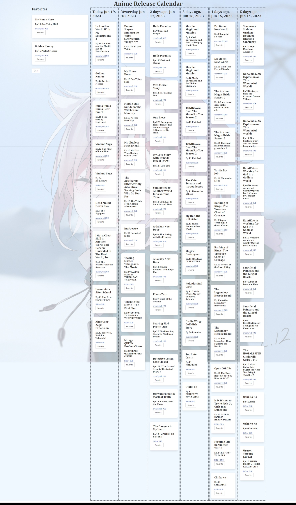

# ARC
Anime Release Calendar, funneling new releases from every major distributor into one page!

## Description

https://jakrau.github.io/ARC/  

The site generates a list of episodes released from the past 6 days. The data for which episodes were released was manually input and stored on the site. The series and episode are listed on a card. As the user hovers over the card on the calendar, an image and summary of the series is displayed on the left. If the user clicks on the series, it takes them to https://myanimelist.net where they can get additional information about the series. If the user clicks on the episode, then they are taken to the video on the stream providers website. The user can click on the 'Favorite' button to add the episode to their favorites which they can click on later.  
Any episode the user favorited will appear on the left where the information on the series is displayed. From here they can also click on the series or episodes like the cards on the calendar. They can 'Remove' an episode using the corresponding button, or they can 'Clear' the entire list by clicking on that button.

## Known Issues
As the site gets its data from manual input, releases after 6/17/2023 were based on available information at the time. As a result, the page will have very limited data to use after 7/8/2023 without an update. Subtitled episode data is typically not available in advance. So, most of that information is not available after 6/17/2023 until the data is updated.

## Future Development Goals
- Add a database so adding information on releases is easier.
- Possibly add a periodic html scrubber since these services don't offer an API (This may have legal issues).
- Have favorites display the most recent episode.
- Have series information menu give information on the episode.

## Technologies Used
Day.js - https://day.js.org/en/  
Jikan API - https://jikan.moe/  
Waifu Generator API - https://waifu.pics/docs  
Bulma CSS Framework - https://bulma.io/  

## References
MyAnimeList - https://myanimelist.net/  
NETFLIX - https://www.netflix.com/  
crunchyroll - https://www.crunchyroll.com/  
HIDIVE - https://www.hidive.com/  
Mozilla Developer Network - https://developer.mozilla.org/en-US/  
W3 Schools - https://www.w3schools.com/

## Credits
Jake Krauskopf - https://github.com/JaKrau  
Michael Taraschi - https://github.com/TheMikal  
Kyle Espera - https://github.com/kyleespera  
Kevin Smith - https://github.com/Cleffy  